<div align="center">

# FxP-Hyprland
### The Ultimate Arch Linux Experience  
*Esthetic • Powerful • Automated*


<br/>


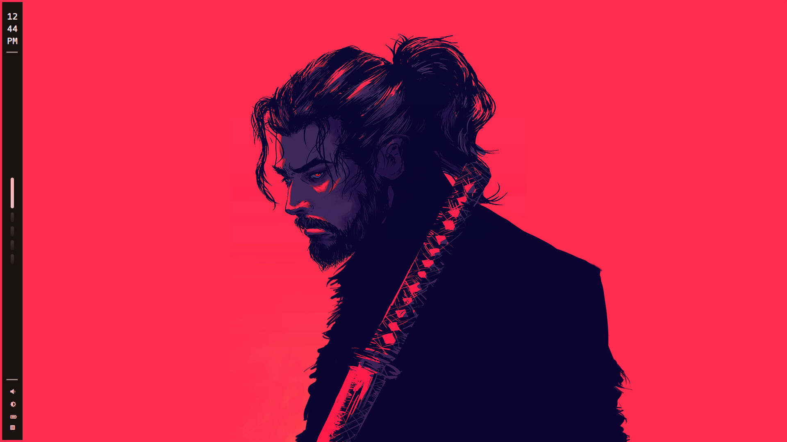
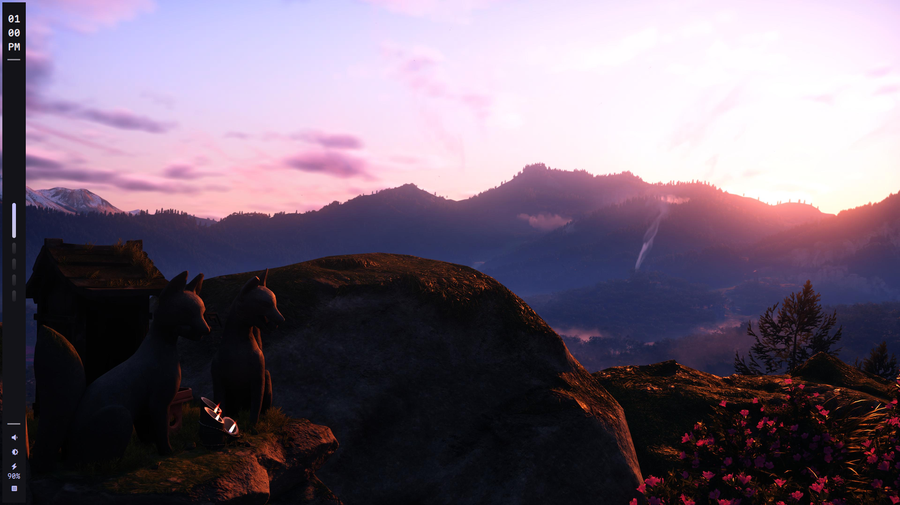


<br/><br/>

**FxP-Hyprland** is a fully riced **Hyprland + Arch Linux** setup focused on  
performance, automation, and a unified cyberpunk aesthetic.

[:framed_picture: Gallery](#gallery) • [:page_facing_up: Installation](#installation) • [:sparkles: Features](#features)

</div>

---

<div align="center">

</div>

---

<a id="installation"></a>
## :one: Installation

> ⚠️ **Important**  
> This setup expects a specific directory layout for automation to work correctly.

### :two: Clone the Repository

```bash
git clone https://github.com/FxP1998/hypr-fxp.git ~/FxP1998
```

### :three: Change directory and make the installer executable

```bash
cd ~/FxP1998 && chmod +x installer.sh
```

### :four: Run the Installer
```bash
./installer.sh
```

<div align="center">
  
</div>

<a id="gallery"></a>

## :framed_picture: Gallery

---

### :computer: Desktop Experience
<p align="center">
  
  
</p>

---

### :closed_lock_with_key: Lockscreen & Logout
<p align="center">
  
  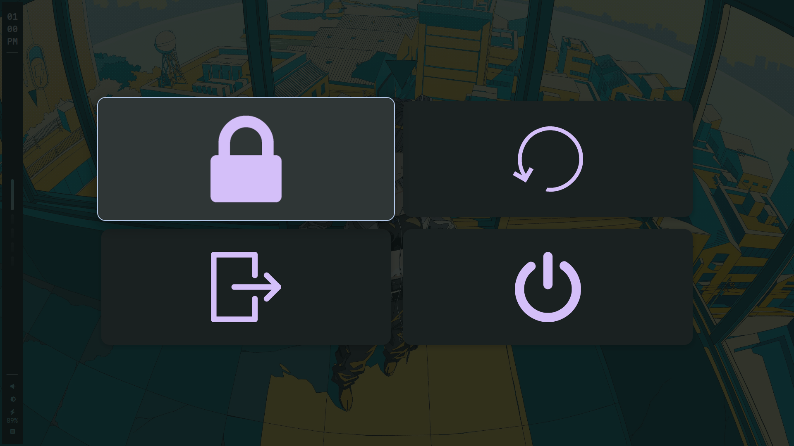
</p>

---

### :pushpin: Waybar

<p align="center" style="white-space: nowrap;">
  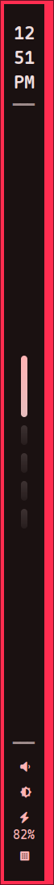
  
  
  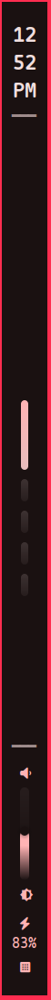
</p>


---

### :memo: Fixnet (Custom Tool)
<p align="center">
  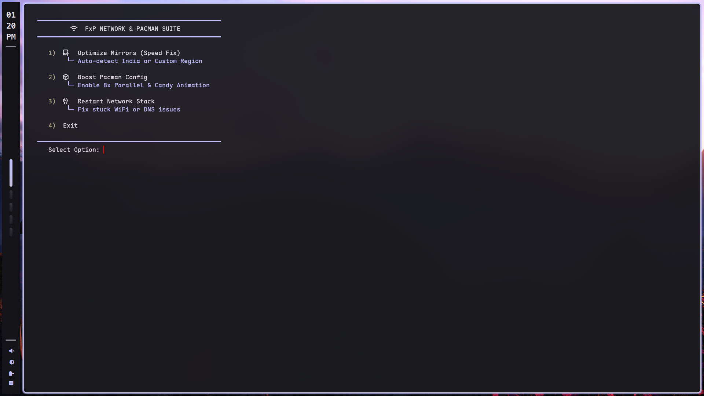
  
  
  
</p>

---

### :rocket: Launchers & Customization
<p align="center">
  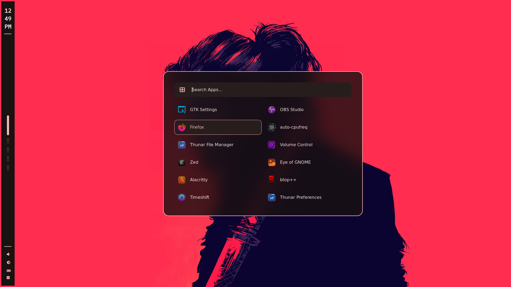
  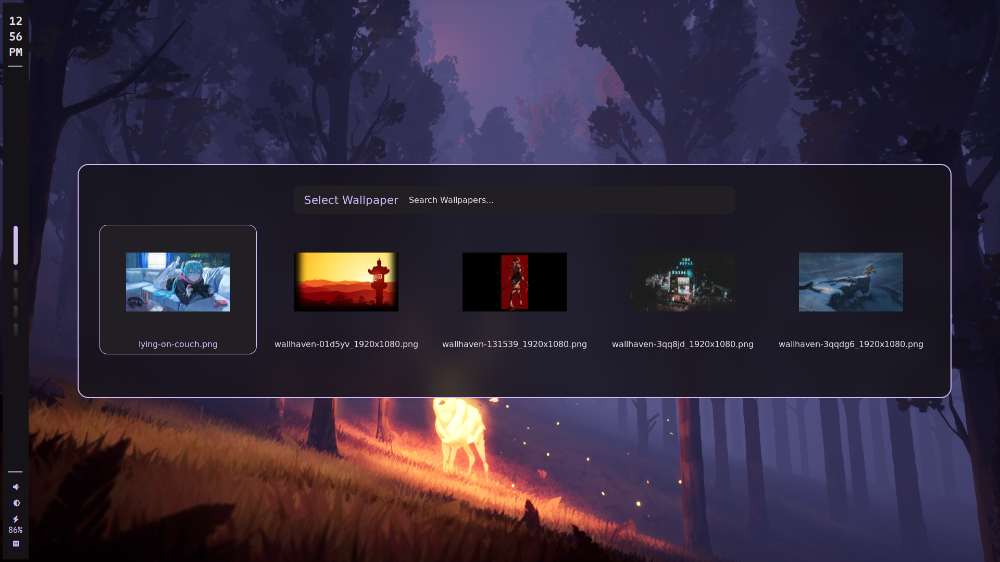
</p>

---

###  :white_square_button: Terminal Workflow
<p align="center">
  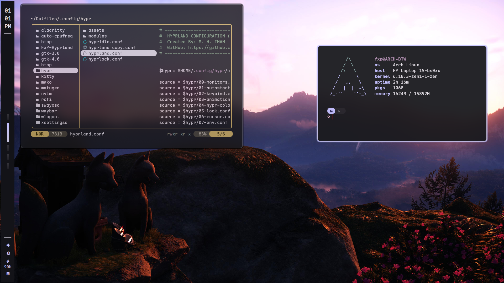
  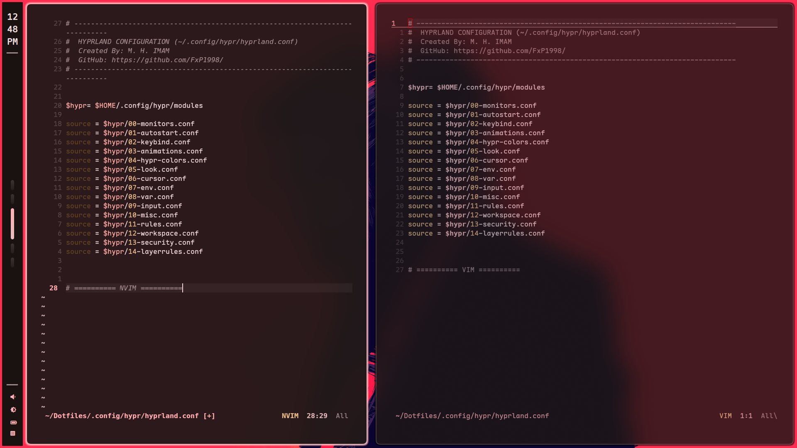
</p>

<p align="center">
  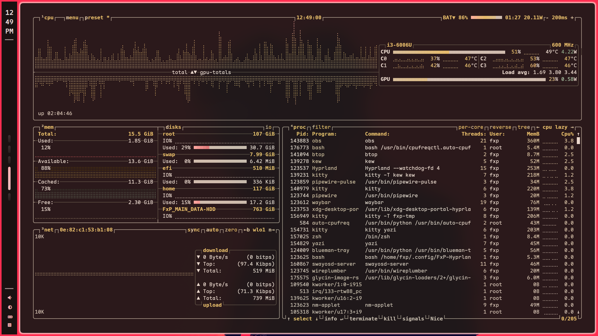
  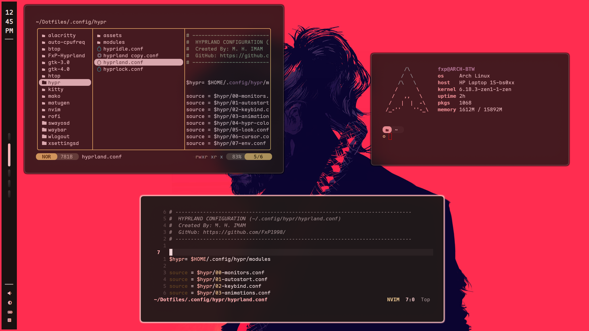
  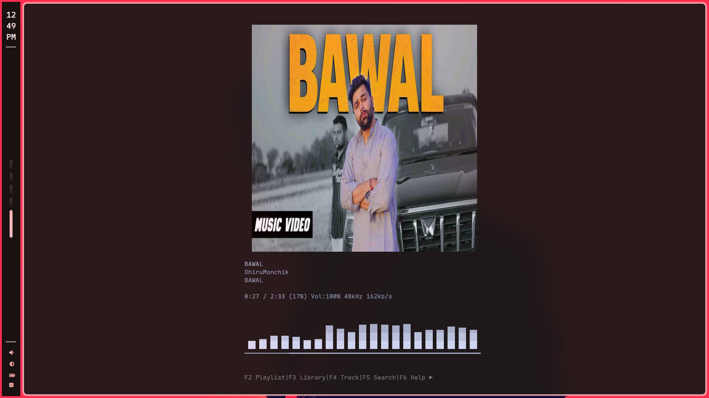
</p>

---

### :open_file_folder: Applications
<p align="center">
  
  
</p>

---

<div align="center">
  
</div>

<a id="features"></a>


<a id="features"></a>

## :bookmark: Dependencies & Features

> All dependencies are installed automatically via **Pacman + Yay**

| Category | Packages |
|--------|----------|
| **Window Manager** | Hyprland, Hyprlock, Hypridle |
| **Bar & Widgets** | Waybar, Rofi-Wayland, Wlogout, Mako |
| **Terminal** | Kitty, Alacritty, Starship, Btop |
| **Editors** | Neovim, Vim, Zed |
| **File Managers** | Thunar, Nautilus, Yazi |
| **System** | Grub (Themed), SDDM (Astronaut), Auto-CPUFreq |
| **Audio** | Pipewire, Wireplumber, Pavucontrol |
| **Network** | NetworkManager, Blueman, **Fixnet (Custom)** |

---

<div align="center">

## 👨‍💻 Author

**M. H. IMAM (FxP1998)**  
Made with ❤️ for the **Arch Linux** community

</div>

