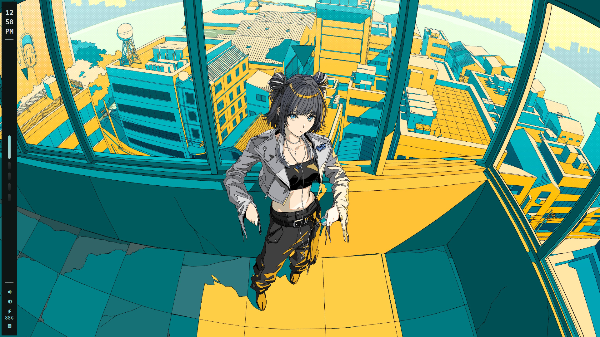
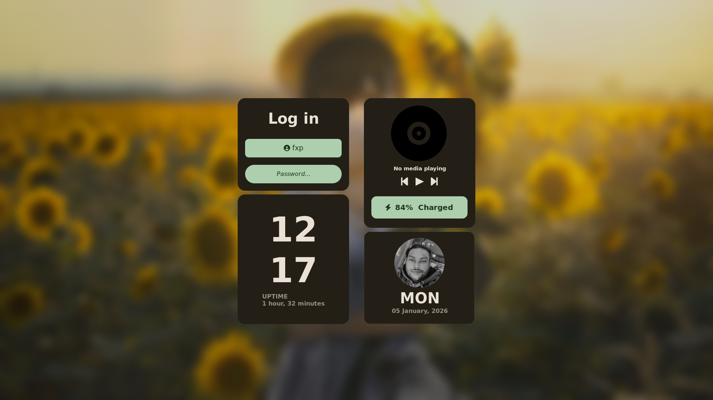
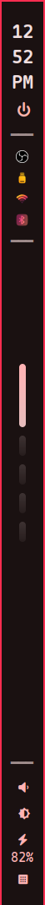
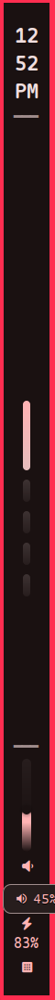
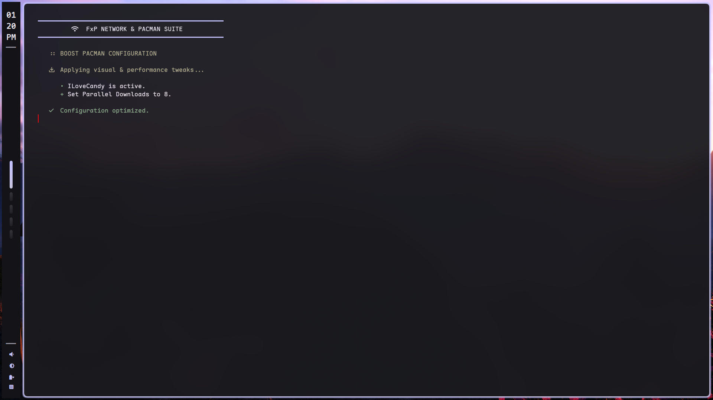
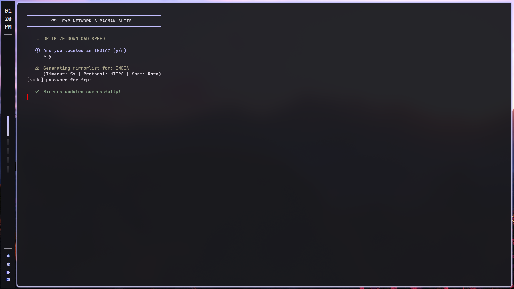
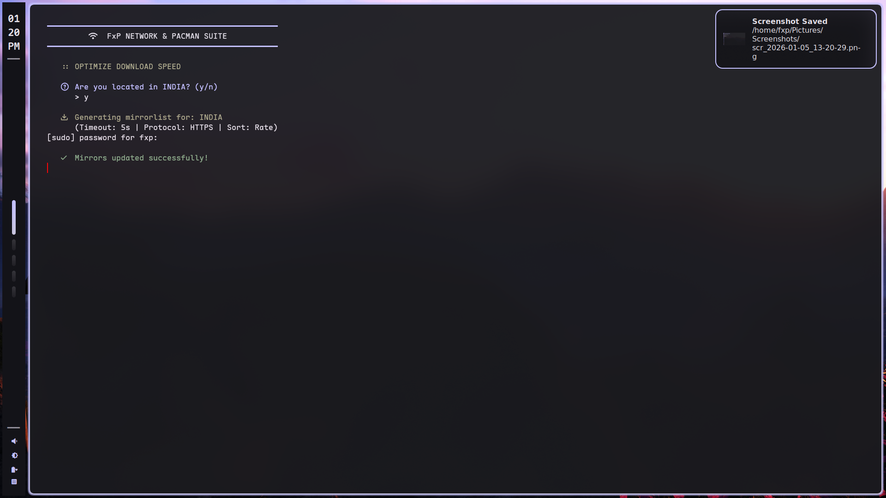
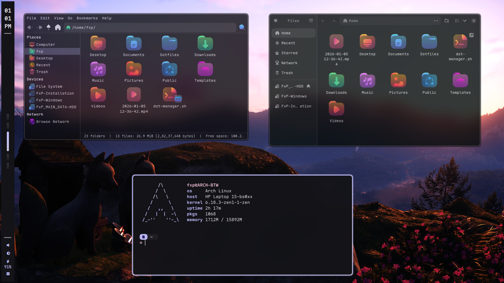
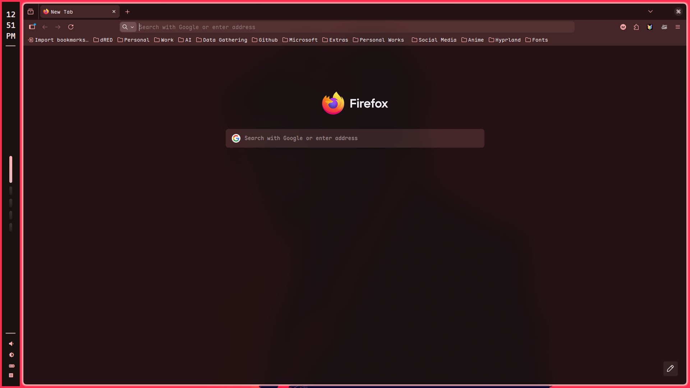

<div align="center">

# FxP-Hyprland
### A highly polished, automated, and minimal Hyprland environment for Arch Linux. ❤️

#### *Official Release • Performance Tuned • Fully Automated*


<br/>




<br/><br/>

**FxP-Hyprland** is a professional-grade **Hyprland + Arch Linux** setup focused on  
extreme performance, surgical automation, and a unified Material You aesthetic.

[:framed_picture: Gallery](#gallery) • [:page_facing_up: Installation](#installation) • [:sparkles: Features](#features)

</div>

---

<div align="center">

</div>

---

<a id="installation"></a>
## 󰒓 Installation

> 󰀦 **System Requirement**  
> This installer is designed for Arch Linux and requires a pure TTY environment for safety.

### 1. Clone the Repository

```bash
git clone https://github.com/FxP1998/hypr-fxp.git ~/FxP1998
```

### 2. Enter and Initialize

```bash
cd ~/FxP1998 && chmod +x installer.sh
```

### 3. Run the Master Installer
```bash
./installer.sh
```

> 󰁔 **Post-Install:** Please reboot your system to apply all environment variables and group permissions.

<div align="center">
  
</div>

<a id="gallery"></a>

## 󰸉 Gallery

---

### 󰣇 Desktop Experience
<p align="center">
  
  
</p>

---

### 󰷛 Lockscreen & Logout
<p align="center">
  
  
</p>

---

### 󰕮 Waybar Modules

<p align="center" style="white-space: nowrap;">
  
  
  
  
</p>

---

### 󰒓 Network & Mirror Tuning (fixnet)
<p align="center">
  
  
  
  
</p>

---

### 󰀻 Rofi Spotlight UI
<p align="center">
  
  
</p>

---

### 󱆃 Terminal Workflow
<p align="center">
  
  
</p>

<p align="center">
  
  
  
</p>

---

### 󰀻 Core Applications
<p align="center">
  
  
</p>

---

<a id="features"></a>

## 󰒓 Core Features

> Automated via the **Master Installer** orchestration suite.

| Category | Components |
|--------|----------|
| **Window Manager** | Hyprland (Modular Config) |
| **Security & Auth** | Polkit-Gnome, Hyprlock |
| **Bar & UI** | Waybar, Rofi (Spotlight), Dunst |
| **Performance** | Auto-CPUFreq, Reflector Tuning | 
| Theming | Matugen (Material You), ADW-GTK3 |
| Virtualization | Libvirt, Virt-Manager, QEMU |
| Terminals | Kitty, Alacritty, Zsh (Starship) |
| **Tools** | Yazi, Btop, Fixnet, Screenshot/Recorder |

---

<div align="center">

## 󰄬 Maintainer

**M. H. IMAM (FxP1998)**  
*Building the future of minimalist computing.*

</div>
